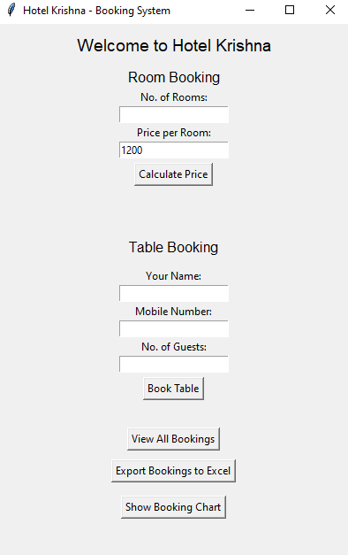
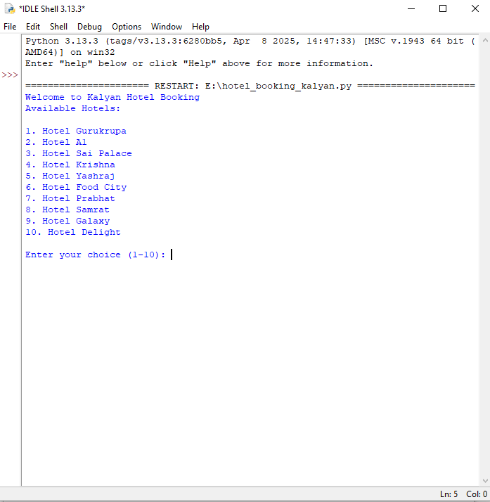

# 🏨 Hotel Booking System – Kalyan

[](https://python.org)
[](#)
[](#)
[](#)
[](#)

---

## 📌 Description

A **Hotel Booking Management System** built with:
- 🐍 Python (backend logic)
- 🪟 Tkinter (graphical interface)
- 🗃 MySQL (database integration)
- 📊 matplotlib & pandas (visualization)

📌 Ideal for learning:
- Basic GUI design
- Database CRUD operations
- Data visualization in Python

---

## 🖼️ Screenshots

| Booking Interface | Data Output |
|------------------|-------------|
|  |  |

More in `/Screenshots` folder.

---

## 🚀 Features

- Room booking system with form input
- Real-time customer data saving to MySQL
- Dynamic plots and reports with matplotlib
- Clean, beginner-friendly GUI

---

## 🛠️ Installation

### 🔧 Prerequisites
- Python 3.x
- MySQL installed
- Pip packages: Tkinter, matplotlib, pandas, mysql-connector-python

### 🧩 Setup

```bash
git clone https://github.com/aryans-sg/hotel-booking-project.git
cd hotel-booking-project
pip install -r requirements.txt
